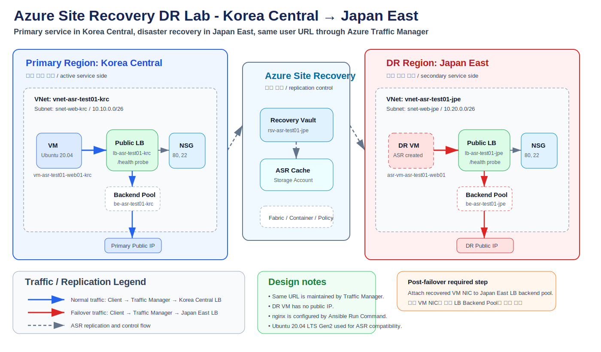
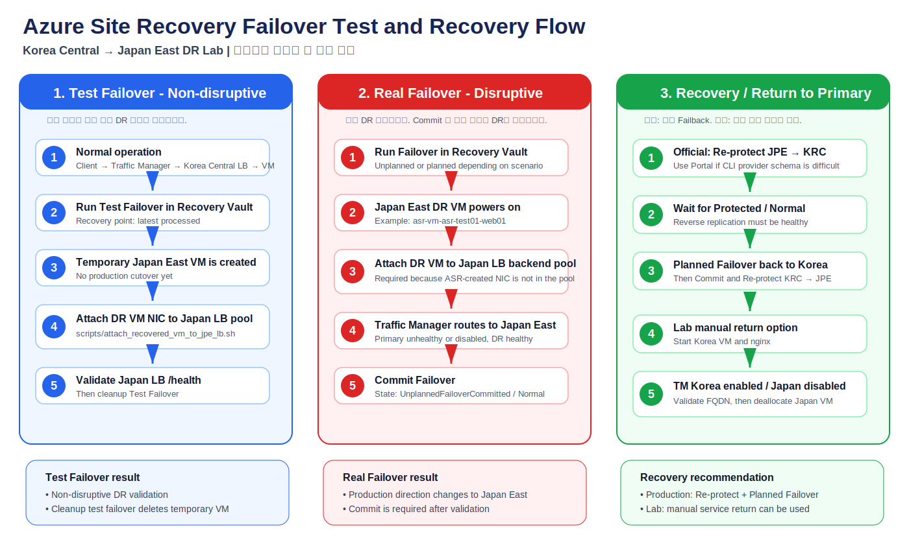
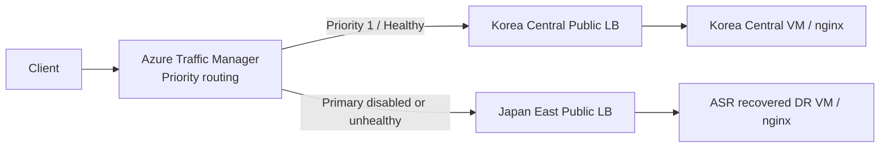

# Azure Site Recovery DR Lab - Korea Central to Japan East

> Main language: English. Korean guide is included near the end.

This repository is a hands-on Azure Site Recovery lab for validating VM disaster recovery from Korea Central to Japan East. It provisions a small nginx workload, exposes it through Azure Standard Public Load Balancers, keeps the same service URL with Azure Traffic Manager Priority routing, and protects the Linux VM with Azure Site Recovery.

The lab was validated through normal service access, ASR Test Failover, real Failover, manual backend pool attachment, Traffic Manager endpoint control, Failover Commit, manual return to Korea Central, and cleanup attempts.

> Important: This is a learning and test repository. It is not a production landing zone. Production use requires private access design, WAF or Application Gateway, managed identity hardening, monitoring, alerting, backup policy, access control, and a formal failback runbook.

---

## Visual diagrams

### Architecture diagram




### Failover test and recovery flow



---

## Table of contents

- [1. Architecture overview](#1-architecture-overview)
- [2. What this repository creates](#2-what-this-repository-creates)
- [3. Repository layout](#3-repository-layout)
- [4. Prerequisites](#4-prerequisites)
- [5. Deployment flow](#5-deployment-flow)
- [6. Configure nginx with Ansible](#6-configure-nginx-with-ansible)
- [7. Normal service validation](#7-normal-service-validation)
- [8. ASR Test Failover runbook](#8-asr-test-failover-runbook)
- [9. Real Failover runbook](#9-real-failover-runbook)
- [10. Recovery and return to Korea Central](#10-recovery-and-return-to-korea-central)
- [11. Cleanup and deletion](#11-cleanup-and-deletion)
- [12. Troubleshooting notes from the lab](#12-troubleshooting-notes-from-the-lab)
- [13. Korean guide](#13-korean-guide)

---

## 1. Architecture overview

The target architecture is simple and intentionally clear for DR testing.

```text
Normal operation
Client
  -> Azure Traffic Manager FQDN
  -> Korea Central Standard Public Load Balancer
  -> Korea Central Linux VM / nginx

DR operation after Test Failover or Failover
Client
  -> Azure Traffic Manager FQDN
  -> Japan East Standard Public Load Balancer
  -> ASR recovered Japan East VM / nginx
```

Traffic Manager is DNS-based. It is not an HTTP proxy. After DNS resolution, user traffic goes directly to the public IP returned by Traffic Manager.



Key design points:

- Azure Standard Public Load Balancer is used, not Application Gateway.
- The recovered DR VM does not need a public IP.
- After ASR creates the recovered VM, the recovered VM NIC must be attached to the Japan East LB backend pool.
- Terraform provisions infrastructure and ASR.
- Ansible through Azure VM Run Command configures nginx.
- Ubuntu 20.04 LTS Gen2 is used because Ubuntu 22.04 latest with a 6.8 Azure kernel caused ASR Mobility Service compatibility issues during validation.

---

## 2. What this repository creates

| Area | Resource | Region | Notes |
|---|---|---|---|
| Primary compute | Linux VM | Korea Central | nginx is configured later by Ansible Run Command |
| Primary network | VNet, subnet, NSG | Korea Central | HTTP 80 and controlled SSH rule |
| Primary frontend | Standard Public Load Balancer | Korea Central | HTTP rule and `/health` probe |
| DR network | VNet, subnet, NSG | Japan East | Used by recovered VM |
| DR frontend | Standard Public Load Balancer | Japan East | Backend is attached after failover |
| DNS routing | Traffic Manager | Global | Priority routing, TTL 30 seconds |
| ASR | Recovery Services Vault | Japan East | Stores ASR configuration |
| ASR | Fabric and protection containers | Korea Central and Japan East | Source and target ASR topology |
| ASR | Replication policy | Japan East vault | 24h retention and 4h app-consistent frequency |
| ASR | Network and container mapping | Korea Central to Japan East | Required for Azure-to-Azure replication |
| ASR | Replicated VM | Korea Central to Japan East | Main protected item |
| Automation | Ansible Run Command | Control machine to Azure VM | Installs nginx and writes health page |

---

## 3. Repository layout

```text
.
├── main.tf
├── lb-outbound.tf
├── variables.tf
├── outputs.tf
├── versions.tf
├── terraform.tfvars.example
├── docs/
│   └── images/
│       ├── asr-dr-architecture.svg
│       └── asr-failover-recovery-flow.svg
├── ansible/
│   ├── playbooks/
│   │   └── configure_nginx_azure_run_command.yml
│   └── templates/
│       └── configure_nginx.sh.j2
├── scripts/
│   ├── attach_recovered_vm_to_jpe_lb.sh
│   ├── asr_status.sh
│   ├── run_ansible_primary.sh
│   ├── run_ansible_vm.sh
│   └── test_dr_flow.sh
└── RUNBOOK-ANSIBLE.md
```

`cloud-init/nginx.yaml` may exist as an older reference, but the validated path is Ansible through Azure VM Run Command.

---

## 4. Prerequisites

Install and authenticate the following on the control machine.

```bash
az version
terraform version
ansible --version
jq --version
curl --version
```

Azure login:

```bash
az login
az account show -o table
```

Install or update the Site Recovery extension:

```bash
az extension add --name site-recovery --upgrade
```

Create or confirm an SSH public key:

```bash
ssh-keygen -t rsa -b 4096 -C asr-test01
cat ~/.ssh/id_rsa.pub
```

Prepare `terraform.tfvars`:

```bash
cp terraform.tfvars.example terraform.tfvars
vi terraform.tfvars
```

Minimum values:

```hcl
admin_username = "azureuser"
admin_source_cidr = "x.x.x.x/32"
ssh_public_key = "ssh-rsa AAAA..."
traffic_manager_relative_name = "sonmap-asr-test01"
vm_size = "Standard_D2s_v3"
```

Avoid `0.0.0.0/0` for SSH except in a short-lived isolated lab.

---

## 5. Deployment flow

```bash
terraform init
terraform fmt -recursive
terraform validate
terraform plan -out tfplan
terraform apply tfplan
```

Expected outputs include:

```text
service_url
traffic_manager_fqdn
primary_lb_public_ip
jpe_lb_public_ip
primary_vm_name
primary_resource_group_name
dr_resource_group_name
recovery_services_vault_name
primary_lb_name
primary_lb_backend_pool_name
dr_lb_name
dr_lb_backend_pool_name
```

Example values observed during the lab:

```text
Primary LB IP: 20.200.209.69
Japan LB IP: 52.253.109.90
Traffic Manager FQDN: sonmap-asr-test01.trafficmanager.net
Primary VM: vm-asr-test01-web01-krc
Recovered DR VM after failover: asr-vm-asr-test01-web01
```

Actual values change per deployment.

---

## 6. Configure nginx with Ansible

The Terraform VM does not rely on cloud-init for application setup. Configure nginx after provisioning.

```bash
chmod +x scripts/*.sh
./scripts/run_ansible_primary.sh
```

The Ansible playbook runs locally and calls Azure VM Run Command. The VM does not need a public IP.

Manual equivalent:

```bash
az vm run-command invoke \
  --resource-group $(terraform output -raw primary_resource_group_name) \
  --name $(terraform output -raw primary_vm_name) \
  --command-id RunShellScript \
  --scripts 'sudo apt-get update -y; sudo apt-get install -y nginx curl jq; echo ok KoreaCentral manual restore | sudo tee /var/www/html/health; sudo systemctl enable nginx; sudo systemctl restart nginx' \
  -o table
```

---

## 7. Normal service validation

Primary LB health:

```bash
curl -m 10 -v http://$(terraform output -raw primary_lb_public_ip)/health
```

Traffic Manager health:

```bash
curl -m 10 -v http://$(terraform output -raw traffic_manager_fqdn)/health
```

Expected response from Korea Central:

```text
HTTP/1.1 200 OK
ok ... KoreaCentral vm-asr-test01-web01-krc
```

Check ASR protected item:

```bash
DR_RG=$(terraform output -raw dr_resource_group_name)
VAULT=$(terraform output -raw recovery_services_vault_name)

az site-recovery protected-item list \
  --resource-group "$DR_RG" \
  --vault-name "$VAULT" \
  --fabric-name asr-fabric-krc \
  --protection-container asr-pc-krc \
  --query '[].{Name:name,FriendlyName:properties.friendlyName,State:properties.protectionState,Health:properties.replicationHealth}' \
  -o table
```

---

## 8. ASR Test Failover runbook

Test Failover should be used first for DR drills. It creates a temporary DR VM and does not commit production failover.


Portal path:

```text
Recovery Services vault
  -> Replicated items
  -> asr-vm-asr-test01-web01
  -> Test failover
```

Recommended choices:

```text
Target region: Japan East
Target VNet: vnet-asr-test01-jpe
Target subnet: snet-web-jpe
Recovery point: Latest processed
```

After the recovered VM appears, list DR VMs:

```bash
az vm list \
  --resource-group $(terraform output -raw dr_resource_group_name) \
  --show-details \
  -o table
```

The VM may not have a public IP. That is expected. It should be reached through the Japan East Load Balancer.

Attach the recovered VM NIC to the Japan East LB backend pool:

```bash
./scripts/attach_recovered_vm_to_jpe_lb.sh \
  -g $(terraform output -raw dr_resource_group_name) \
  -v <RECOVERED_VM_NAME> \
  -l $(terraform output -raw dr_lb_name) \
  -p $(terraform output -raw dr_lb_backend_pool_name)
```

Check Japan East LB:

```bash
curl -m 10 -v http://$(terraform output -raw jpe_lb_public_ip)/health
```

To test Traffic Manager DR routing, either stop nginx on Primary or disable the Primary Traffic Manager endpoint.

Stop Primary nginx:

```bash
az vm run-command invoke \
  --resource-group $(terraform output -raw primary_resource_group_name) \
  --name $(terraform output -raw primary_vm_name) \
  --command-id RunShellScript \
  --scripts 'sudo systemctl stop nginx' \
  -o table
```

Disable Primary endpoint:

```bash
TM_RG=$(terraform output -raw primary_resource_group_name)
TM_PROFILE=$(az network traffic-manager profile list -g "$TM_RG" --query '[0].name' -o tsv)

az network traffic-manager endpoint update \
  -g "$TM_RG" \
  --profile-name "$TM_PROFILE" \
  --name ep-krc-primary-lb \
  --type azureEndpoints \
  --endpoint-status Disabled
```

Cleanup Test Failover:

```text
Recovery Services vault
  -> Replicated items
  -> asr-vm-asr-test01-web01
  -> Cleanup test failover
```

After cleanup, the Japan LB may time out because the temporary DR VM was deleted. That is normal.

---

## 9. Real Failover runbook

Real Failover is not a drill. It creates the actual DR VM and changes the ASR protected item state.

High-level flow:

```text
1. Start real Failover
2. Japan East VM is created
3. Attach recovered VM NIC to Japan LB backend pool
4. Validate Japan LB /health
5. Switch Traffic Manager or allow health-based priority routing
6. Commit Failover
7. Japan East becomes the committed active side
```

Portal path:

```text
Recovery Services vault
  -> Replicated items
  -> asr-vm-asr-test01-web01
  -> Failover
```

After Failover, the DR VM name observed in this lab was:

```text
asr-vm-asr-test01-web01
```

Attach it to the Japan East LB:

```bash
./scripts/attach_recovered_vm_to_jpe_lb.sh \
  -g $(terraform output -raw dr_resource_group_name) \
  -v asr-vm-asr-test01-web01 \
  -l $(terraform output -raw dr_lb_name) \
  -p $(terraform output -raw dr_lb_backend_pool_name)
```

Commit Failover with Azure CLI:

```bash
DR_RG=$(terraform output -raw dr_resource_group_name)
VAULT=$(terraform output -raw recovery_services_vault_name)
ITEM_NAME=asr-vm-asr-test01-web01

az site-recovery protected-item failover-commit \
  --resource-group "$DR_RG" \
  --vault-name "$VAULT" \
  --fabric-name asr-fabric-krc \
  --protection-container asr-pc-krc \
  -n "$ITEM_NAME"
```

Observed successful state:

```text
State  = UnplannedFailoverCommitted
Health = Normal
```

---

## 10. Recovery and return to Korea Central

A formal ASR failback requires this sequence:

```text
1. Re-protect from Japan East to Korea Central
2. Wait until reverse replication becomes Protected / Normal
3. Planned Failover back to Korea Central
4. Validate Korea VM, nginx, Korea LB, and Traffic Manager
5. Commit failback
6. Re-protect again from Korea Central to Japan East
```

During this lab, Azure CLI `reprotect` provider details were difficult to satisfy because the Site Recovery extension expected a nested `a2-a` schema and disk details. For production-style failback, use Azure Portal Re-protect or a thoroughly tested automation runbook.

For a lab-only manual service return:

```bash
cd ~/Azure_Azure-Site-Recovery_test01

PRIMARY_RG=$(terraform output -raw primary_resource_group_name)
DR_RG=$(terraform output -raw dr_resource_group_name)
PRIMARY_VM=$(terraform output -raw primary_vm_name)
DR_VM=asr-vm-asr-test01-web01
```

Start Korea VM:

```bash
az vm start -g "$PRIMARY_RG" -n "$PRIMARY_VM"
```

Start or reinstall nginx:

```bash
az vm run-command invoke \
  -g "$PRIMARY_RG" \
  -n "$PRIMARY_VM" \
  --command-id RunShellScript \
  --scripts 'sudo systemctl start nginx || true; sudo systemctl enable nginx || true; if ! command -v nginx >/dev/null 2>&1; then sudo apt-get update -y && sudo apt-get install -y nginx; fi; echo ok KoreaCentral manual restore | sudo tee /var/www/html/health; sudo systemctl restart nginx' \
  -o table
```

Ensure Korea VM NIC is attached to Korea LB backend pool:

```bash
NIC_ID=$(az vm show -g "$PRIMARY_RG" -n "$PRIMARY_VM" --query 'networkProfile.networkInterfaces[0].id' -o tsv)
NIC_NAME=$(basename "$NIC_ID")

az network nic ip-config address-pool add \
  -g "$PRIMARY_RG" \
  --nic-name "$NIC_NAME" \
  --ip-config-name ipconfig1 \
  --lb-name $(terraform output -raw primary_lb_name) \
  --address-pool $(terraform output -raw primary_lb_backend_pool_name) || true
```

Switch Traffic Manager back to Korea:

```bash
TM_RG="$PRIMARY_RG"
TM_PROFILE=$(az network traffic-manager profile list -g "$TM_RG" --query '[0].name' -o tsv)

az network traffic-manager endpoint update \
  -g "$TM_RG" \
  --profile-name "$TM_PROFILE" \
  --name ep-krc-primary-lb \
  --type azureEndpoints \
  --endpoint-status Enabled

az network traffic-manager endpoint update \
  -g "$TM_RG" \
  --profile-name "$TM_PROFILE" \
  --name ep-jpe-dr-lb \
  --type azureEndpoints \
  --endpoint-status Disabled
```

Validate Korea service:

```bash
curl -m 10 -v http://$(terraform output -raw primary_lb_public_ip)/health
curl -m 10 -v http://$(terraform output -raw traffic_manager_fqdn)/health
nslookup $(terraform output -raw traffic_manager_fqdn)
```

After Korea is confirmed, deallocate Japan VM:

```bash
az vm deallocate -g "$DR_RG" -n "$DR_VM"
```

---

## 11. Cleanup and deletion

### Standard cleanup after Test Failover

```text
Recovery Services vault
  -> Replicated items
  -> asr-vm-asr-test01-web01
  -> Cleanup test failover
```

### Delete lab after real Failover Commit

If protected item removal fails because the source VM is deallocated, start the Korea VM first:

```bash
PRIMARY_RG=$(terraform output -raw primary_resource_group_name)
PRIMARY_VM=$(terraform output -raw primary_vm_name)
az vm start -g "$PRIMARY_RG" -n "$PRIMARY_VM"
```

Remove the ASR protected item:

```bash
DR_RG=$(terraform output -raw dr_resource_group_name)
VAULT=$(terraform output -raw recovery_services_vault_name)
ITEM_NAME=asr-vm-asr-test01-web01

az site-recovery protected-item remove \
  -g "$DR_RG" \
  --vault-name "$VAULT" \
  --fabric-name asr-fabric-krc \
  --protection-container asr-pc-krc \
  -n "$ITEM_NAME"
```

If this is only a lab and remove fails, use forced delete:

```bash
az site-recovery protected-item delete \
  -g "$DR_RG" \
  --vault-name "$VAULT" \
  --fabric-name asr-fabric-krc \
  --protection-container asr-pc-krc \
  -n "$ITEM_NAME"
```

Then remove ASR replicated VM from Terraform state and destroy:

```bash
terraform state rm azurerm_site_recovery_replicated_vm.primary 2>/dev/null || true
terraform destroy -auto-approve
```

If anything remains, delete the resource groups:

```bash
PRIMARY_RG=$(terraform output -raw primary_resource_group_name 2>/dev/null || echo rg-asr-test01-krc)
DR_RG=$(terraform output -raw dr_resource_group_name 2>/dev/null || echo rg-asr-test01-jpe)

az group delete --name "$PRIMARY_RG" --yes --no-wait
az group delete --name "$DR_RG" --yes --no-wait

az group wait --deleted --name "$PRIMARY_RG"
az group wait --deleted --name "$DR_RG"
```

Final check:

```bash
az group exists --name "$PRIMARY_RG"
az group exists --name "$DR_RG"
```

Expected:

```text
false
false
```

---

## 12. Troubleshooting notes from the lab

### Git clone could not resolve github.com

Symptom:

```text
Could not resolve host: github.com
```

Check DNS and proxy:

```bash
ping -c 3 8.8.8.8
getent hosts github.com
nslookup github.com
cat /etc/resolv.conf
curl -I https://github.com
```

### `test_subnet_name` unsupported

The AzureRM provider did not support `test_subnet_name` for `azurerm_site_recovery_replicated_vm`. Remove that argument.

### Standard LB outbound rule required `disable_outbound_snat = true`

When the same frontend IP configuration is referenced by an outbound rule, the inbound LB rule must disable outbound SNAT.

```hcl
disable_outbound_snat = true
```

### VM SKU unavailable in Korea Central

`Standard_B2s` was not available in Korea Central during validation. Use:

```hcl
vm_size = "Standard_D2s_v3"
```

### ASR Mobility Service rejected Ubuntu 22.04 latest kernel

ASR failed with a 539 error because the Mobility Service version did not support the source VM kernel `6.8.0-1059-azure`. The lab was changed to Ubuntu 20.04 LTS Gen2.

### DR VM has no public IP

This is expected. Use the Japan East Load Balancer public IP:

```bash
curl -v http://$(terraform output -raw jpe_lb_public_ip)/health
```

### Failover Commit CLI option

The correct option in the tested CLI extension was `-n` or `--replicated-protected-item-name`.

```bash
az site-recovery protected-item failover-commit \
  -g "$DR_RG" \
  --vault-name "$VAULT" \
  --fabric-name asr-fabric-krc \
  --protection-container asr-pc-krc \
  -n asr-vm-asr-test01-web01
```

### Re-protect CLI schema issues

The CLI extension reported `a2-a` as the expected provider details object. Manual JSON attempts may still fail depending on extension version. Portal Re-protect is recommended for this lab.

### Disable replication failed because VM was deallocated

Symptom:

```text
Disable replication requires action within the VM which thus requires VM to be in running power status.
```

Fix:

```bash
az vm start -g "$PRIMARY_RG" -n "$PRIMARY_VM"
```

Then retry ASR remove/delete.

### Traffic Manager endpoint update ResourceNotFound

If the error path contains `trafficmanagerprofiles/azureEndpoints`, the `TM_PROFILE` variable is probably empty. Set it explicitly.

```bash
TM_RG=rg-asr-test01-krc
TM_PROFILE=tm-asr-test01-dk9p9
```

---

## 13. Korean guide

### 13.1 목적

이 저장소는 Azure Site Recovery를 이용해 Korea Central VM을 Japan East로 복제하고, 장애 시 같은 URL로 DR 리전에 접속되는지 확인하기 위한 실습용 Terraform/Ansible 예제입니다.

```text
정상 운영
사용자 -> Traffic Manager -> Korea Central LB -> Korea Central VM

장애 또는 Failover 후
사용자 -> Traffic Manager -> Japan East LB -> ASR로 생성된 Japan East VM
```

### 13.2 도식화 이미지

- `docs/images/asr-dr-architecture.svg`: 전체 ASR DR 아키텍처 구성도
- `docs/images/asr-failover-recovery-flow.svg`: Failover 테스트 및 복구 절차도

### 13.3 주요 검증 내용

```text
1. Terraform apply 성공
2. Korea Central VM 생성
3. Ansible Run Command로 nginx 설치
4. Primary LB /health 정상 응답
5. Traffic Manager /health 정상 응답
6. ASR 복제 구성
7. Test Failover 후 Japan East VM 생성
8. Japan East VM NIC를 Japan LB Backend Pool에 연결
9. Japan LB /health 정상 응답
10. 실제 Failover 수행
11. Failover Commit 성공
12. 수동으로 서울 VM 기동 및 Traffic Manager 서울 전환 절차 확인
13. 삭제 시 ASR protected item 제거 필요 확인
```

### 13.4 Test Failover 방법

Portal에서 수행합니다.

```text
Recovery Services vault
  -> Replicated items
  -> asr-vm-asr-test01-web01
  -> Test failover
```

Japan East VM이 생성되면 LB에 연결합니다.

```bash
./scripts/attach_recovered_vm_to_jpe_lb.sh \
  -g $(terraform output -raw dr_resource_group_name) \
  -v <RECOVERED_VM_NAME> \
  -l $(terraform output -raw dr_lb_name) \
  -p $(terraform output -raw dr_lb_backend_pool_name)
```

Japan LB 확인:

```bash
curl -m 10 -v http://$(terraform output -raw jpe_lb_public_ip)/health
```

### 13.5 실제 Failover와 Commit

실제 Failover는 테스트가 아니라 DR 전환입니다. Failover 후 검증이 끝나면 Commit합니다.

```bash
DR_RG=$(terraform output -raw dr_resource_group_name)
VAULT=$(terraform output -raw recovery_services_vault_name)

az site-recovery protected-item failover-commit \
  -g "$DR_RG" \
  --vault-name "$VAULT" \
  --fabric-name asr-fabric-krc \
  --protection-container asr-pc-krc \
  -n asr-vm-asr-test01-web01
```

성공 상태:

```text
State  = UnplannedFailoverCommitted
Health = Normal
```

### 13.6 복구 방법

정식 복구는 다음 순서입니다.

```text
1. Re-protect: Japan East -> Korea Central 역복제
2. Protected / Normal 상태 확인
3. Planned Failover to Korea Central
4. Korea VM, nginx, Korea LB 확인
5. Failover Commit
6. Re-protect: Korea Central -> Japan East 재보호
```

실습 환경에서는 수동으로 서울 서비스를 다시 올릴 수도 있습니다.

```bash
PRIMARY_RG=$(terraform output -raw primary_resource_group_name)
DR_RG=$(terraform output -raw dr_resource_group_name)
PRIMARY_VM=$(terraform output -raw primary_vm_name)
DR_VM=asr-vm-asr-test01-web01

az vm start -g "$PRIMARY_RG" -n "$PRIMARY_VM"

az vm run-command invoke \
  -g "$PRIMARY_RG" \
  -n "$PRIMARY_VM" \
  --command-id RunShellScript \
  --scripts 'sudo systemctl start nginx; sudo systemctl enable nginx' \
  -o table
```

Traffic Manager를 서울로 전환합니다.

```bash
TM_RG="$PRIMARY_RG"
TM_PROFILE=$(az network traffic-manager profile list -g "$TM_RG" --query '[0].name' -o tsv)

az network traffic-manager endpoint update \
  -g "$TM_RG" \
  --profile-name "$TM_PROFILE" \
  --name ep-krc-primary-lb \
  --type azureEndpoints \
  --endpoint-status Enabled

az network traffic-manager endpoint update \
  -g "$TM_RG" \
  --profile-name "$TM_PROFILE" \
  --name ep-jpe-dr-lb \
  --type azureEndpoints \
  --endpoint-status Disabled
```

일본 VM 중지:

```bash
az vm deallocate -g "$DR_RG" -n "$DR_VM"
```

### 13.7 삭제

Failover Commit 이후에는 ASR protected item 때문에 Vault 삭제가 막힐 수 있습니다. 먼저 서울 VM을 running 상태로 만든 후 보호 항목을 제거합니다.

```bash
az vm start -g "$PRIMARY_RG" -n "$PRIMARY_VM"

az site-recovery protected-item remove \
  -g "$DR_RG" \
  --vault-name "$VAULT" \
  --fabric-name asr-fabric-krc \
  --protection-container asr-pc-krc \
  -n asr-vm-asr-test01-web01
```

그 후 Terraform state 정리와 destroy를 수행합니다.

```bash
terraform state rm azurerm_site_recovery_replicated_vm.primary 2>/dev/null || true
terraform destroy -auto-approve
```

남은 리소스 그룹 삭제:

```bash
az group delete --name rg-asr-test01-krc --yes --no-wait
az group delete --name rg-asr-test01-jpe --yes --no-wait
```

---

## Final note

This repository intentionally documents both successful and failed paths from the lab. The failures are useful because ASR operations often depend on provider versions, VM power state, OS kernel compatibility, and Site Recovery CLI extension schemas. For production-grade failback, prefer Azure Portal Re-protect or a thoroughly tested automation runbook.
